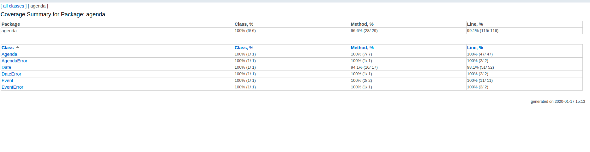

# Qualité Logicielle Master 2 ILD Saint Jérôme AMU 2019

**Chriss Osler Santi**\
Last edition 2020-01-17

Notes:
-   Used packages:\
    For this project I've used two externals packages that are:
    - [Lombock](https://projectlombok.org/): Project Lombok is a java library that automatically plugs into your editor and build tools, spicing up your java.
    - JUnit 4 for the tests.
    
    In order to use lombock one needs to configure its IDE. Follow this [tutorial](https://www.baeldung.com/lombok-ide) to set lombock for [IntelliJ](https://www.jetbrains.com/idea/) or [Eclipse](https://www.eclipse.org/downloads/packages/).
    
### Coverage Report

The units tests I wrote cover:
   - 100% of the classes
   - 99.1% of the total code lines
   - 96.6% of the Methods
   

These results are obtained using the IntelliJ code coverage tool.

You can find the coverage report in the folder [coverage_report](./coverage_report) (double click).
